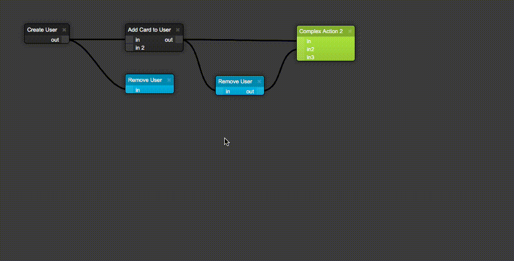

# STORM React Diagrams

This library makes it easy to create interactive flow diagrams using react.
You can create custom elements as long as they contain Port Components.

The system is not yet 100% production ready and there are still many improvements regarding speed and optimisation that need to be made, but those are all currently in the works, and will be gradually improved over time.

