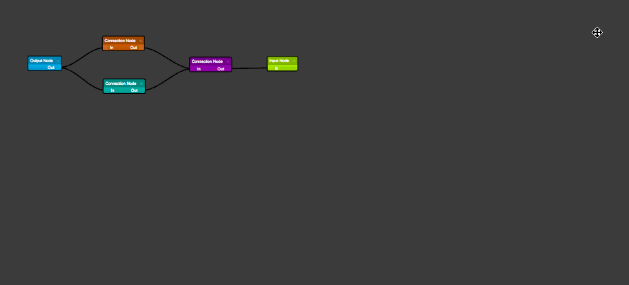
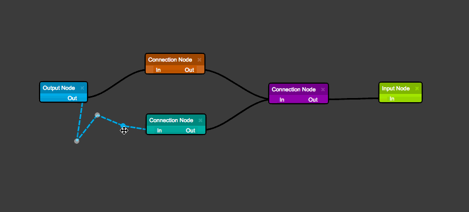

# STORM React Diagrams

__DEMO__: http://www.projectstorm.io/react-diagrams

A super simple, no-nonsense diagramming library written in React that just works.

[](https://gitter.im/projectstorm/react-diagrams?utm_source=badge&utm_medium=badge&utm_campaign=pr-badge&utm_content=badge)
[](https://npmjs.org/package/storm-react-diagrams)
[](https://npmjs.org/package/storm-react-diagrams)


## Introduction

A no-nonsense diagramming library written entirely in React with the help of Lodash, and a single polyfill. It aims to be:

* Simple, and void of any fuss/complications when implementing it into your own application
* Customizable without having to hack the core (adapters/factories etc..)
* Simple to operate and understand without sugar and magic
* Fast and optimized to handle large diagrams with hundreds of nodes/links
* Super easy to use, and should work as you expect it to

## Roadmap

* Port everything over to JSX (busy with this)
* Make keybindings customizable (maybe pluggable)
* Move path logic associated with links into a base link class so we can easily extend links
* Add more fault tolerance

## How to install

```
npm install storm-react-diagrams
```
or
```
yarn add storm-react-diagrams
```

## How to build

Simply run ```webpack``` in the root directory (or ```export NODE_ENV=production && webpack``` if you want a production build) and it will spit out the transpiled code and typescript definitions into the dist directory as a single file. __It will also compile the code for the demos__ .We use webpack for this because TSC cannot compile a single UMD file (TSC can currently only output multiple UMD files).

_NOTE:_ We turn off name mangeling in production builds because we require class names to be left intact when serializing.

## Make your own nodes

To see how to create your own nodes like the one below, take a look at __demo3__:


## How does it work

The library uses a Model Graph to represent the virtual diagram and then renders the diagram using
2 layers:
* Node Layer -> which is responsible for rendering nodes as HTML components
* Link Layer -> which renders the links as SVG paths

Each node and link is fed into a factory that then generates the corresponding node or link react widget.
Therefore, to create custom nodes and links, register your own factories that return your own widgets.

As long as a node contains at least one port and the corresponding NodeWidget contains at least one PortWidget,
a link can be connected to it.

## Events

[Event System](docs/Events.md)

## Questions

[Questions](docs/Questions.md)

##  Usage

__Delete__ removes any selected items


__Shift + Mouse Drag__ triggers a multi-selection box


__Shift + Mouse Click__ selects the item (items can be multi-selected)


__Mouse Drag__ drags the entire diagram


__Mouse Wheel__ zooms the diagram in / out


__Click Link + Drag__ creates a new link point


__Click Node Port + Drag__ creates a new link

