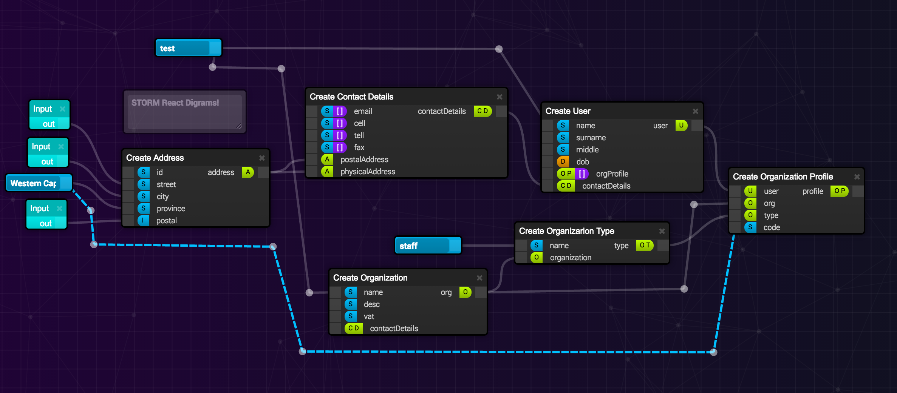
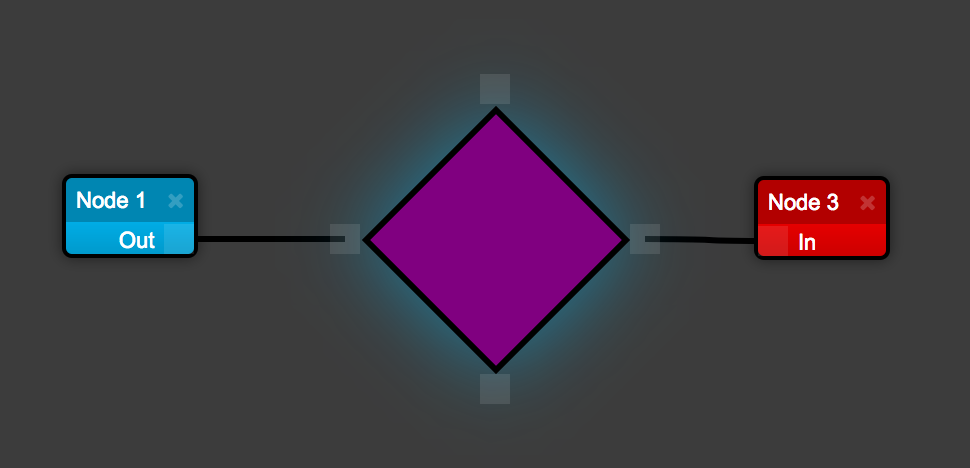

# STORM React Diagrams

__DEMO__: http://www.projectstorm.io/react-diagrams

__Latest Release Notes__: http://dylanv.blog/2018/01/18/storm-react-diagrams-v4-0-0/

__NB:// 5.0.0__ is currently in the works! https://github.com/projectstorm/react-diagrams/pull/145

A super simple, no-nonsense diagramming library written in React that just works.

[](https://gitter.im/projectstorm/react-diagrams?utm_source=badge&utm_medium=badge&utm_campaign=pr-badge&utm_content=badge)
[](https://npmjs.org/package/storm-react-diagrams)
[](https://npmjs.org/package/storm-react-diagrams)
[](https://circleci.com/gh/projectstorm/react-diagrams/tree/master)





## Introduction

A no-nonsense diagramming library written entirely in React with the help of a few small libraries. It aims to be:

* Simple, and void of any fuss/complications when implementing it into your own application
* Customizable without having to hack the core (adapters/factories etc..)
* Simple to operate and understand without sugar and magic
* Fast and optimized to handle large diagrams with hundreds of nodes/links
* Super easy to use, and should work as you expect it to
* Perfect for creating declarative systems such as programmatic pipelines and visual programming languages 

## Usage

#### Installing

`npm install storm-react-diagrams` or `yarn add storm-react-diagrams`

#### Getting started

The best place to start is by looking at the simple demos `demos/demo-simple` and going from there.

#### Run the demos

After running `yarn install` you must then run:  `yarn run storybook`

#### Building from source

Simply run ```webpack``` in the root directory (or ```export NODE_ENV=production && webpack``` if you want a production build) and it will spit out the transpiled code and typescript definitions into the dist directory as a single file. 
We use webpack for this because TSC cannot compile a single UMD file (TSC can currently only output multiple UMD files).


## Make your own nodes

To see how to create your own nodes like the one below, take a look at __demos/demo-custom-link1__:



## Learn More

[Architecture Questions](docs/Architecture%20Questions.md)

[Interactive Questions](docs/Interactive%20Usage.md)

[Testing the Library](docs/Testing.md)


