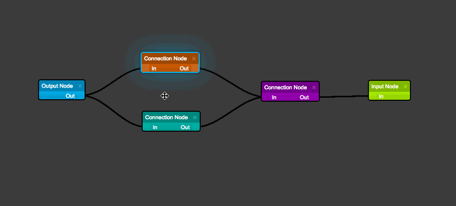
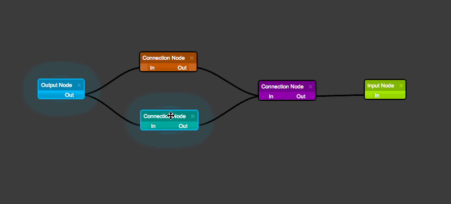
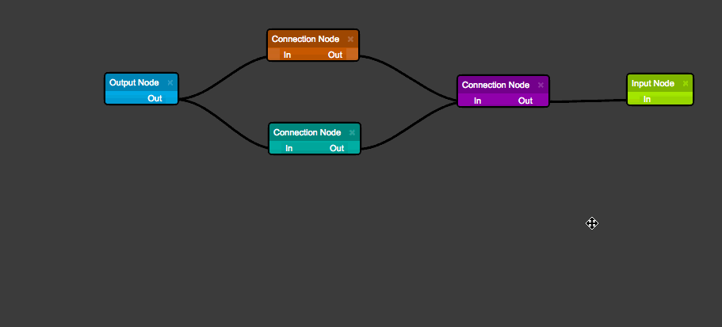
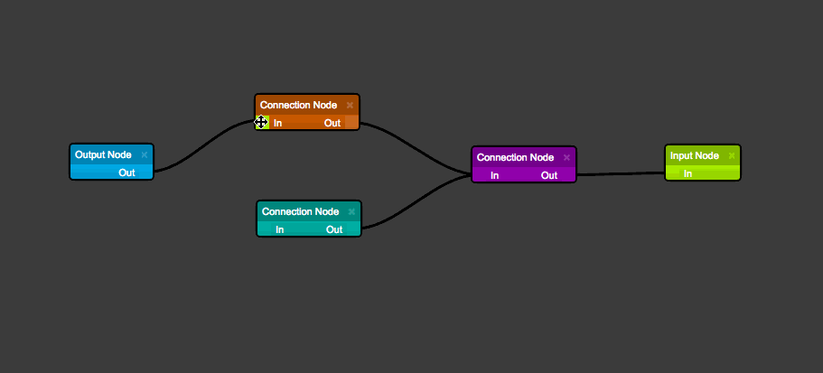

# End user usage

__Delete__ removes any selected items

__Shift + Mouse Drag__ triggers a multi-selection box

__Shift + Mouse Click__ selects the item (items can be multi-selected)

__Mouse Drag__ drags the entire diagram

__Mouse Wheel__ zooms the diagram in / out

__Click Link + Drag__ creates a new link point

__Click Node Port + Drag__ creates a new link
