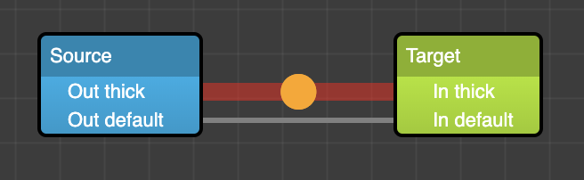

# Custom Links

## Extending the DefaultLinkModel

Much like extending nodes, custom links can also be created.
In the below example, we have created a link that renders a circle animating from the source port to the target port.



In this specific example, we extended the `DefaultLinkModel` because we wanted to retain
a lot of the functionality that it provides in the base class:

```typescript
export class AdvancedLinkModel extends DefaultLinkModel {
	constructor() {
		super({
			type: 'advanced', // <-- here we give it a new type
			width: 10 // we specifically want this to also be width 10
		});
	}
}
```

Now we need to create a new link factory to tell the system how our new link model fits into the core system. We specifically are going to extend the `DefaultLinkFactory` because we still want to render a `DefaultLinkWidget`. The only difference is that we want each __path segment__ to be a red line with an animating circle. Fortunately, the `DefaultLinkWidget` already uses the `generateLinkSegment()` method defined in the `DefaultLinkFactory` to accomplish this. The only thing we need to do, is provide a different type of segment:

```typescript
export class AdvancedLinkFactory extends DefaultLinkFactory {
	constructor() {
		super('advanced'); // <-- this matches with the link model above
	}

	generateModel(): AdvancedLinkModel {
		return new AdvancedLinkModel(); // <-- this is how we get new instances
	}

    /**
     * @override the DefaultLinkWidget makes use of this, and it normally renders that
     * familiar gray line, so in this case we simply make it return a new advanced segment.
     */
	generateLinkSegment(model: AdvancedLinkModel, selected: boolean, path: string) {
		return (
			<g>
				<AdvancedLinkSegment model={model} path={path} />
			</g>
		);
	}
}
```

The actual code for the `AdvancedLinkSegment` [can be found here](https://github.com/projectstorm/react-diagrams/tree/master/diagrams-demo-gallery/demos/demo-custom-link1) (it is in the `demo-custom-link1` folder in the demo gallery).

This is the easiest and most simple way to get started with custom links. 
